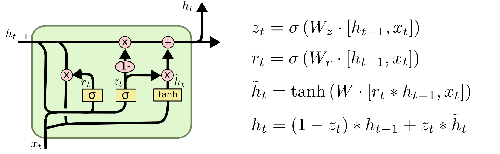

# A Gated Recurrent Unit (GRU) type LSTM language model, trained on the Harry Potter Series Text.
## Libraries used :
Theano, Numpy
## GRU-LSTM Equations
(Figure from the blog post <a href=http://colah.github.io/posts/2015-08-Understanding-LSTMs/>"Understanding LSTM Networks"</a>)

## Parameters of the model:
<li> vocabulary size = 3000 ( out of ~27000 total words in text corpus)</li>
<li> word embedding size ( hidden layer dimension ) = 128</li>
<li> Number of GRU layers = 2</li>

<b>Total Number of Parameters</b>  ~= 2*(vocabulary size)*(hidden dimension) + Weights   ~= 1 million  
<b>Number of training sentences</b> = 82725 ( with average length of 15 words )

## Results and Performance
<b> The model uses categorical crossy-entropy cost on softmax output, and nesterov momentum update for error back-propagation. It is being trained currently ( on a GPU with CUDA compute capability = 3.0 ), and a few representative sentences it could generate will be posted here.</b> 
## References:
1. http://karpathy.github.io/2015/05/21/rnn-effectiveness/
2. http://colah.github.io/posts/2015-08-Understanding-LSTMs/
